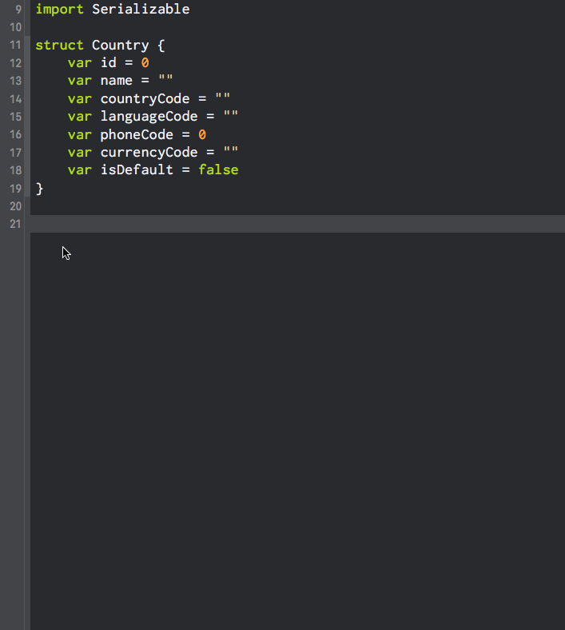

# Model Boiler

**Model Boiler** is a macOS application used to quickly generate Codable conformance when you need custom mapping for one or more keys

*Gif is outdated, but you get the point*

## 📦 Installation

### Homebrew Cask

1. Run this command in your terminal

~~~bash
brew cask install model-boiler
~~~

### Release

1. Head over to the [latest release](https://github.com/nodes-ios/ModelBoiler/releases/latest)
2. Download the `Model Boiler.app.zip`.
3. Unzip & open the executable file.

### Manual

1. Download or clone the repository.
2. Install the dependencies by running `carthage bootstrap --platform osx` from the unzipped folder in your terminal.
3. Open the `Model Boiler.xcodeproj`.
4. Archive.
5. Choose Export ("Save Built Products" option) in the Organizer window.
6. Open the executable located at:  

~~~bash
~/Desktop/Model Boiler {DATE}/Products/Applications/Model Boiler.app
~~~

## 💻 Usage

Model Boiler is a menu bar application, meaning that you won't find it's icon in the Dock. If you want to access the settings, update or quit Model Boiler then look for the icon in the top menu bar on the right side.

### Generating Code

1. Select your model code
2. Press the Model Boiler shortcut (can be customized in settings)
3. Paste the generated code
4. Profit!

### Settings

**Key case conversion** is one of the features of Model Boiler, which allows you to easily convert your key names from `yourProperty` to `your_property`. (note: this is overriden if custom key is specified)

**Custom shortcut** can be configured in the settings window of Model Boiler and the default shortcut is `⌘ + §`.

**Note:** Model Boiler currently doesn't support nested structs. You will need to generate boilerplate code for your nested structs separately.

## 📝 Requirements

Xcode 11.4  
Swift 5.2

## :octocat: Dependencies

### [SwiftSyntax](https://github.com/apple/swift-syntax)

> A tool for inspecting and rewriting Swift code

### [SwiftSemantics](https://github.com/SwiftDocOrg/SwiftSemantics)

> Convenience on top of SwiftSyntax

## 👥 Credits

Made with ❤️ at [Nodes](http://nodesagency.com).

## 📄 License

**Model Boiler** is available under the MIT license. See the [LICENSE](https://github.com/nodes-ios/ModelBoiler/blob/master/LICENSE) file for more info.
